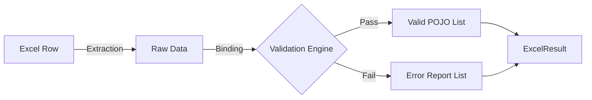
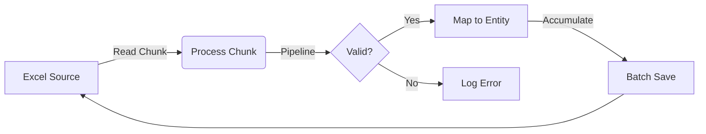

# 🐔 MyPoio

Dynamic Excel-to-POJO mapping and validation engine for Java.

MyPoio is a **lightweight, extensible library** built on top of Apache POI to remove the boilerplate of parsing Excel files. It turns rows into objects and validates them before they ever reach your business logic.

---

## 🐣 Why "MyPoio"?

The name is a pun. Apache POI is powerful, but using it directly is like handling raw chicken ("Pollo" or "Poio" in slang) — it's messy, requires a lot of preparation, and if you're not careful, it can make your code sick (NullPointers, Memory Leaks, Spaghetti code).

MyPoio cooks it for you. It takes the "raw" POI and serves you clean, validated, and ready-to-use Java Objects.

---

## General Features

- **Annotation-Driven**: Map columns and define validation rules directly in your DTOs (e.g., `@ExcelColumn`, `@ExcelRequired`).
- **Built-in Validation Engine**: Validates data during the read process. If a cell is invalid (e.g., invalid email, future date), you get a detailed error report instead of a crash.
- **Custom Validations**: Easily add your own validation rules by implementing the validation interfaces, without modifying the core engine.
- **Resource Safety**: Implements `AutoCloseable` to ensure file handles and workbooks are closed properly, preventing memory leaks.
- **Engine Agnostic**: The core logic is decoupled from the file reading mechanism. You can plug in different Excel readers (not limited to Apache POI) by implementing the reader interfaces.
- **Low Coupling by Design**: All components communicate through well-defined interfaces, making the system extensible, testable, and easy to maintain.
- **Zero Boilerplate**: No more `row.getCell(0).getStringCellValue()`.

---

## Installation

```xml
<dependency>
  <groupId>io.github.cm-ms</groupId>
  <artifactId>mypoio</artifactId>
  <version>1.0.4</version>
</dependency>
```

---

## How to use?

Parsing Excel files is as simple as defining your data model. Just add annotations to your DTO class to bind columns and enforce constraints.

1. **Annotate** your class with `@ExcelModel`.
2. **Map** fields using `@ExcelColumn`.
3. **Validate** the data using ready-made decorators such as `@ExcelRequired` or `@ExcelAllowedValues`, or with your own.

#### Example of DTO mapping

```java
@ExcelModel(index = 0)
public class EmployeeDto {

    @ExcelColumn(index = 0) // mapping by index
    @ExcelRequired
    private String name;

    @ExcelColumn(reference="B") // mapping by letter
    @ExcelEmail
    private String email;

    @ExcelColumn(reference="c") // mapping by letter
    @ExcelAllowedValues({"IT", "HR", "SALES"})
    private String department;
}

```

#### Example Usage

Once your DTO is defined, use the `ExcelReader` to process the input stream.

The library returns an `ExcelResult` object, which acts as a comprehensive report of the operation. Instead of halting on the first error, it captures both valid data and validation failures, giving you full control over the response.

By default, the reader **skips the first row** (header). If you need to start from a different row (e.g., index 4 for files without headers), you can configure it using `.offsetRow(rowNumber)`.

Here is an example using a Spring `RestController`:

```java
@RestController
@RequestMapping
public class MyController {

  @PostMapping("/upload")
  public ResponseEntity<?> uploadExcel(@RequestParam("file") MultipartFile file) {
    try (InputStream is = file.getInputStream()) {

      // 1. Create the reader for your DTO.
      // Default behavior: starts reading from row 1 (skips header).
      ExcelReader<EmployeeDto> reader = new ExcelReader<>(EmployeeDto.class)
              .offsetRow(4); // Optional: Customize start row if needed

      // 2. Process the file
      ExcelResult<EmployeeDto> result = reader.initRead(is);

      // 3. Handle the result
      if (result.hasErrors()) {
        // Return specific error messages to the client
        return ResponseEntity.badRequest().body(result.getRowErrors());
      }

      // Return only the valid, converted objects
      return ResponseEntity.ok(result.getValidData());

    } catch (Exception e) {
      return ResponseEntity.internalServerError().body("Error: " + e.getMessage());
    }
  }
}
```
#### How it Works?

MyPoio processes data in a streamlined pipeline, ensuring separation of concerns between
reading, binding, and validating.


---

## Custom Validation

Need to validate specific formats (like documents), unique IDs, or complex business rules? The library is designed to be easily extensible.

You can create your own custom annotations in just 3 steps:

#### 1. Create the Annotation
Define your annotation and link it to a validator class using `@ExcelConstraint`.

```java
@Retention(RetentionPolicy.RUNTIME)
@Target(ElementType.FIELD)
@ExcelConstraint(validatedBy = DocumentValidator.class) // Link to your logic
public @interface ExcelDocument {
  String message() default "Invalid document format";
}
```

#### 2. Implement the Logic
   Create a class that implements AnnotationValidator. This is where you put your validation rules.

```java
public class DocumentValidator implements AnnotationValidator<ExcelDocument> {
  
  @Override
  public void validate(ExcelDocument annotation, ExcelCell excelCell, List<ExcelError> errorList) {
      String value = excelCell.getValue();
      
      // Your custom logic here (e.g., check document algorithm)
      if (!isValidDocument(value)) {
          errorList.add(new ExcelError("INVALID_DOCUMENT", annotation.message()));
      }
  }
}
```

#### 3. Use it!

Just annotate your DTO fields with your new annotation.


```java
@ExcelModel
public class EmployeeDto {

  @ExcelColumn(index = 0)
  private String name;

  @ExcelDocumentoBR // Your custom validation
  @ExcelColumn(index = 1)
  private String documentNumber;
}
```

That's it! Now just run the reader and watch the magic happen. The library automatically detects your annotation and applies your validation logic to every row.

---

## Advanced: Pipelines & Batch Processing

For large files, loading the entire result into memory is not efficient. MyPoio provides a **Pipeline API** that allows you to process data in **chunks**, transforming and saving it as it streams.

This approach is perfect for **ETL operations**, keeping your memory footprint low.

### ⚙️ How the Pipeline Works



#### Scenario 1: The "Streamlined" Flow (ETL Style)
Use this when you only care about valid data and want to transform and save it directly to a database.

* **`withChunkSize(n)`**: defines the batch size.
* **`onlyValid()`**: automatically filters out rows with errors (unwraps the result).
* **`map()`**: transforms the DTO into your domain entity.
* **`forEachChunk()`**: executes a consumer (e.g., repository save) for every batch.

```java
new ExcelReader<>(PersonDto.class)
    .offsetRow(1)
    .withChunkSize(100) // Process 100 rows at a time
    .pipeline()
    .onlyValid() // Filter valid DTOs automatically
    .map(Person::new) // Transform DTO -> Entity
    .forEachChunk(personRepository::saveAll) // Batch insert
    .read(inputStream);
```

#### Scenario 2: Granular Control (Mixed Valid/Invalid)
Use `forEachItemChunk` when you need access to the `ExcelResultItem` wrapper to handle both success and failure cases within the same batch.

```java
new ExcelReader<>(PersonDto.class)
    .withChunkSize(50)
    .pipeline()
    .forEachItemChunk(items -> {
        List<Person> validEntities = new ArrayList<>();

        for (ExcelResultItem<PersonDto> item : items) {
            if (item.isValid()) {
                // Happy path: Collect for saving
                validEntities.add(new Person(item.getData()));
            } else {
                // Error path: Log or handle specific errors
                log.error("Row {} failed: {}", item.getRowNumber(), item.getErrors());
            }
        }
        
        // Save the valid batch
        personRepository.saveAll(validEntities);
    })
    .read(inputStream);
```

---

### 🔑 Key Pipeline Methods

| Method | Description |
|:---|:---|
| `.withChunkSize(int)` | Defines how many rows are processed in memory before flushing. |
| `.pipeline()` | Switches the reader to Pipeline Mode. |
| `.onlyValid()` | Filters the stream to return only valid data objects (discards errors). |
| `.map(Function)` | Transforms the data object (e.g., `DTO` -> `Entity`). |
| `.forEachChunk(Consumer)` | Executes an action on a list of transformed objects. |
| `.forEachItemChunk(Consumer)` | Executes an action on a list of `ExcelResultItem` wrappers (gives you access to errors). |


## Annotation Processing Rules

### 1. Class Level: `@ExcelModel`
Marks a class as an Excel model. This is the entry point for the reader.

* **Rule:** Only classes annotated with `@ExcelModel` are processed.
* **Function:** Defines which sheet index to read.

```java
@ExcelModel(index = 0)
public class EmployeeDto { 
    //methods and attributes 
}
```
### 2. Field Level: @ExcelColumn

Defines the mapping between a Java field and an Excel column.

* **Rule**: The engine only reads fields annotated with `@ExcelColumn`.

* **Function**: Binds the field to a column index. Fields without this annotation are skipped.

```java
@ExcelColumn(index = 1)
private String email;
```

### 3. Validation Chain
Validation annotations (like `@ExcelEmail`, `@ExcelRequired`) act as constraints on the data.

> **IMPORTANT**  
> Dependency Rule: Validation annotations are evaluated only if the field is also annotated with `@ExcelColumn`.

If you use a validation annotation without mapping the column, it will be **silently ignored**.


**✅ Valid example:**
```java
@ExcelColumn(index = 1) // Mapped
@ExcelEmail             // Validated
private String email;
```

**❌ Incorrect (Will be ignored):**
```java
@ExcelEmail             // No column mapping -> No validation
private String email;
```

---

## Current Validations

| Validation | Description |
|-----------|-------------|
| `@ExcelAllowedValues` | Restricts the cell value to a predefined list of allowed values. |
| `@ExcelBoolean` | Validates that the cell value represents a boolean (`true/false`, `yes/no`, etc., depending on implementation). |
| `@ExcelEmail` | Validates that the cell value is a valid email format. |
| `@ExcelNumber` | Ensures the cell contains a numeric value. |
| `@ExcelFuture` | Ensures the date value is in the future. |
| `@ExcelPast` | Ensures the date value is in the past. |
| `@ExcelPatternDate` | Validates the date format against a predefined pattern. |
| `@ExcelPhone` | Validates that the cell value matches a phone number format. |
| `@ExcelRegex` | Validates the cell value using a custom regular expression. |
| `@ExcelRequired` | Ensures the cell is not null or blank. |
| `@ExcelSize` | Validates the length of a string (min and/or max size). |


---
## Project Roadmap

### Completed / Implemented

1. Dynamic Excel reading using annotations (values initially treated as `String`) ✅  
2. Dynamic validation engine inspired by Jakarta Validation ✅  
3. Support for custom validation rules beyond the built-in ones ✅  
4. Ability to skip validations when needed ✅  
5. Minimized coupling through dynamic initializers and interfaces ✅  
6. Reduced dependency on error-return structures (cleaner result model) ✅  
7. Decoupling from Apache POI (used as default implementation, not a hard dependency) ✅

---

### Long-Term Goals

- Provide a fully configurable processing pipeline  
- Enable enterprise-grade data ingestion with strong validation and normalization  
- Keep the core lightweight, extensible, and framework-agnostic

---

## Contribution

1. Fork the project.
2. Create your Feature Branch.
3. Commit your changes.
4. Push to the branch.
5. Open a Pull Request.

---

Built with ❤️ (and Chicken) by **cmms**
